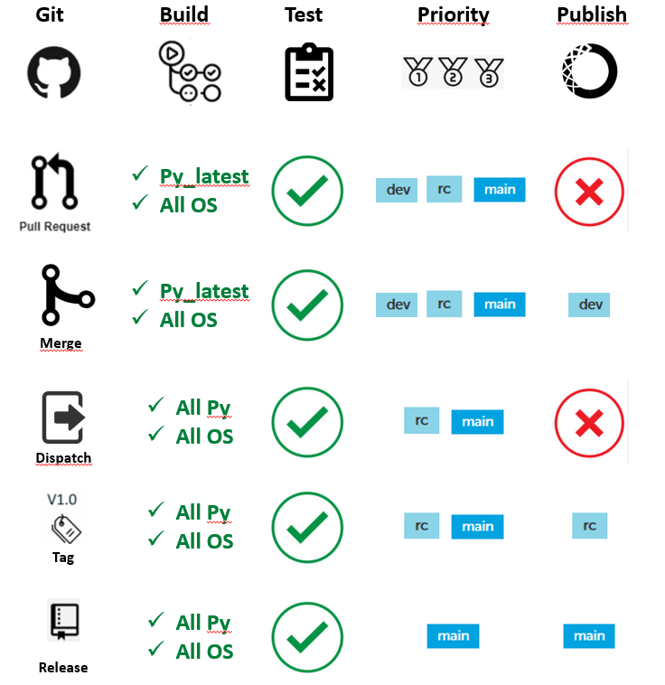

# A reusable CI workflow to Build and Publish Openalea Packages

This repo host a collection of Github Actions and reusable workflows to build your software package and publish to an Anaconda repository.

These actions have been developed for the needs of [`OpenAlea` project](https://openalea.readthedocs.io/en/latest/). It is mostly inspired by existing projects such as [build-and-upload-conda-packages](https://github.com/marketplace/actions/build-and-upload-conda-packages) or [Publish Conda package to Anaconda.org](https://github.com/marketplace/actions/publish-conda-package-to-anaconda-org) and uses [Setup Miniconda](https://github.com/marketplace/actions/setup-miniconda).

The main workflow using these actions can be found [here](./doc/workflows/build_publish_promote/README.md)

It allows trigerring different CI jobs, depending on the context:

## Documentation

### Actions 
- [setup-ci](./doc/actions/setup-ci/README.md)
- [build-publish-anaconda](./doc/actions/build_and_publish/README.md)

### Workflows
- [build_publish_promote](./doc/workflows/build_publish_promote/README.md)
- [test_setup](./doc/workflows/test_setup/README.md)
- [test_dummy](./doc/workflows/test_dummy/README.md)

