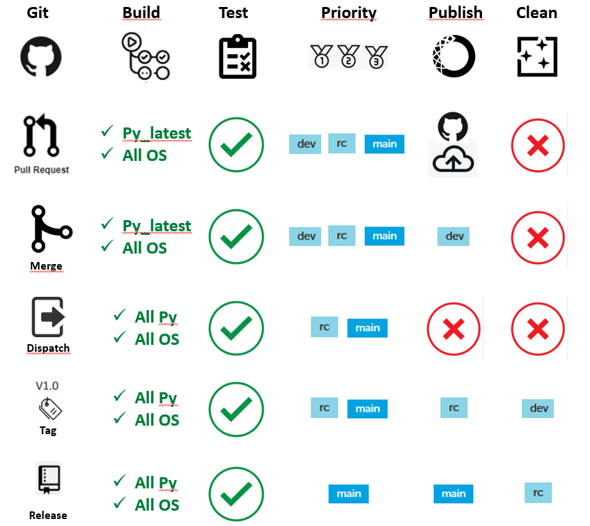

# A reusable CI workflow to Build and Publish Openalea Packages

[](https://opensource.org/licenses/MIT)

This repo host a collection of Github Actions and reusable workflows to build your Python software package and publish to an Anaconda repository.
It is mostly inspired by existing projects such as [build-and-upload-conda-packages](https://github.com/marketplace/actions/build-and-upload-conda-packages) or [Publish Conda package to Anaconda.org](https://github.com/marketplace/actions/publish-conda-package-to-anaconda-org) and uses [Setup Miniconda](https://github.com/marketplace/actions/setup-miniconda).

These actions have been primariliy developed for the needs of [`OpenAlea` project](https://openalea.readthedocs.io/en/latest/). 
The associated development workflow is:
- create a branch for new development
- push on git (CI does nothing at this stage)
- when done, open a PR (CI will build on highest_py, upload an build artifact on action page, and test the package, but do not publish it on anaconda)
- check CI results, ask for review, ammend PR (CI is re-run after each push)
- when CI and review are okay, merge PR (CI will build on highest_py and publish on dev channel)
- repeat open branch / PR / merge as much as needed
- when a new stable version of the package is ready for publication on openalea, 
  go to 'actions' tab of your Github project, click on 'OpenAlea CI' and 'Run'. 
  this will trigger a CI build on all supported os x py version.
- If CI check is okay, congrats, you can push a new tag (vx.x.x). CI will build, test and
  publish your package on rc (release candidate) channel.
- Publication on openalea main channel will be done by OpenAlea core developer team or during Release coding sprints.

## Installation

If you belong to openalea organisation, please follow [these installation instructions](./doc/workflows/openalea_ci/README.md) to activate CI on your repo.

If you want to test it in another context, just add and [configure to your needs](./doc/workflows/openalea_ci/README.md) the following `.github/workflows/openalea_ci.yml` file in your repository:

```yaml
name: OpenAlea CI

on:
... # triggering event of your choice

jobs:
  build:
    uses: openalea/action-build-publish-anaconda/.github/workflows/openalea_ci.yml@main
    secrets:
      anaconda_token: ${{ secrets.ANACONDA_TOKEN }}
```

## Default behaviour
 
By default OpenAlea CI listen to git-events happening on your repo and launch a set of actions that depends that event:



Note that for pure python packages, the publication is only triggered after build on ubuntu-latest.

## Run CI workflow locally

During the development process, you might find yourself needing to test your package build without pushing to GitHub. However, using `conda-build` directly can mess with your local environment. To avoid this, we recommand to use the [GitHub Local Actions](https://marketplace.visualstudio.com/items?itemName=SanjulaGanepola.github-local-actions) VS-Code extension.

If you don't use VS-Code, you can still use [`nektos/act`](https://nektosact.com/), a tool that allows you to run GitHub Actions locally, which is the core component of the extension mentioned above.

The most relevant case for testing openalea_ci workflow is probably when you're developing on your branch my_awesome_branch. However, you need to have an associated Pull Request to trigger the workflow (a "simple" push event on a development branch doesn't trigger any workflow, cf. https://github.com/openalea/action-build-publish-anaconda/blob/main/images/CI_workflow.png).

This can be specified in the VS-CODE "Github Local Actions" / "Workflows" section / "Run event" (thunder icon) - Pull Request event or directly running act pull_request.


## Documentation

### Actions

- [setup-ci](./doc/actions/setup-ci/README.md) : preliminary computation of inputs and environment variables to the `builkd-publish-anaconda` action as a function of the context (branch, tag, pull request, etc.).
- [build-publish-anaconda](./doc/actions/build_and_publish/README.md) : main action that actually builds the conda package and publishes it to an Anaconda repository.

### Main workflow

- [openalea_ci](./doc/workflows/openalea_ci/README.md) : main workflow that is meant to be used in your package. It combines the `setup-ci` and `build-publish-anaconda` actions.

### Testing and internal documentation workflows

- [test_setup](./doc/workflows/test_setup/README.md) : for testing the `setup-ci` action in different simulated contexts.
- [test_dummy](./doc/workflows/test_dummy/README.md) : test the chaining of `setup-ci` and `build-publish-anaconda` actions on two dummy packages : one pure Python and one non pure Python.
- [generate_docs](./doc/workflows/generate_docs/README.md) : internal workflow that creates a PR to update the documentation of the actions and workflows in this repository.
